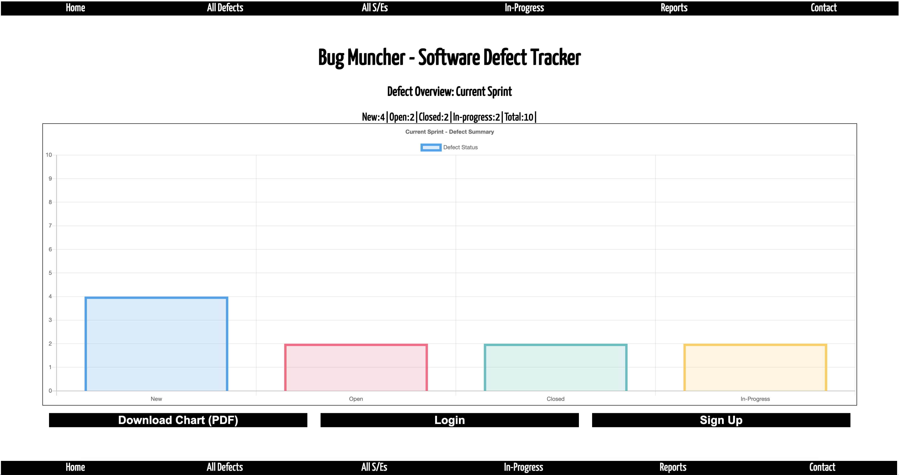

## Table of contents
* [General info](#general-info)
* [BugMuncher Link](#bugmuncher-link)
* [Necessary Deliverables](#necessary-deliverable)
* [To Do](#to-do)
* [Screenshots](#screenshots)
* [In-depth Features of BugMuncher](#in-depth-features-of-BugMuncher)
* [Challenges](#challenges)
* [Technologies Used](#technologies-used)
* [Approach Taken](#approach-taken)
* [Download](#download)

## General info
This project is to demonstrate both client side and Server side technologies:

* Have ideally 2 resources(tables) (more if they make sense) – one representing someone using your application, and one that represents the main functional idea for your app
* Include sign up/log in functionality(if they make sense), with encrypted passwords & an authorization flow
* Have complete RESTful routes for at least one of your resources with GET, POST, PATCH, and DELETE
* Include wireframes that you designed during the planning process
* Have semantically clean HTML and CSS
* Be deployed online and accessible to the public

## BugMuncher Link
* The link to the BugMuncher online application is here:
[https://bugmuncher.herokuapp.com]
* Public ER Diagram link:
[https://whimsical.com/M9h9oNGHibMCgt7BQ5H4pn]

## Necessary Deliverables
* A working full-stack application, built by you, hosted somewhere on the internet
* A link to your hosted working app in the URL section of your GitHub repo
* A git repository hosted on GitHub, with a link to your hosted project, and frequent commits dating back to the very beginning of the project. Commit early, commit often.
* A readme.md file with explanations of the technologies used, the approach taken, installation instructions, unsolved problems, etc.
* Wireframes of your app, hosted somewhere & linked in your readme (photos of your sketches on paper or whiteboard are fined)
* A link in your readme.md to the publically-accessible planning diagrams (eg. ER diagrams)

## To-Do
Need to do the following:
* Update the drop down HTML lists to correctly ensure that their current role is automatically 'Selected' as default.
* Include the duration time stamps for when a new defect is raised and to when it is closed.
* Include the functionality that tracks the requirement points that a defect pertains to.
* Integrate multiple table joins to ensure cohesiveness is maintained and referential integrity is enforced.
* Create 'Contact' Page and update Social links.
* Implement the pagination for > 15 records.
* Fix the footer permanantly to the bottom of page.

## Screenshots

## In-depth Features of BugMuncher
* Software Engineers can register and use the portal to manage defects for each sprint/project.
* Software Engineers can create NEW, UPDATE, DELETE defects.
* Managers can visualise easy to understand reports.
* The main defect graph automatically updates as defects are raised, udpated and closed.
* Tracking of the Velocity is also catered for.

## Challenges
* Establishing logic to immitate computer AI which was resolved by randomizing index positions to fill if a slot was available.

## Approach Taken
* Via pen and paper, wireframed a basic outline of key elements to be used and how positioned.
* Also via pen and paper, constructed simple ER diagram as part of it.
* Functionality wise, ensure the server side database functionality operated well via PostGres and Ruby.
* Ensured all routes are functional.
* Secondly, ensured that the client side presentation was reasonable.
* Finally, introduced some client side Javascript to update graphs in real time via DOM manipulation and the use of chartjs CDN.

## Technologies Used
Project is created with:
* Javascript
* CSS
* HTML
* DOM manipulation
* Ruby
* PostGres
* 3rd party CDNs: chartjs
	
## Download
Download via:

* https://github.com/mistergjones/BugMuncher.git
